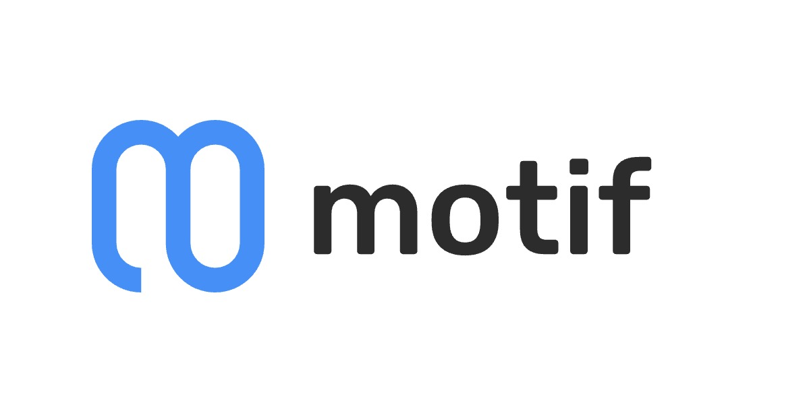

# Motif: AI-Driven Staking Optimization Platform.

Motif: AI-Driven Staking Optimization Platform.
Simplifying Polkadot Staking with Real-Time Notifications, ML-driven Pools and AI-based Staking Support

## Our Objectives

- Increase the accessibility and optimization of staking
- Make it easier for users to participate in staking using advanced data analysis and AI technologies
- Provide validators with a flow of new nominators
- Maintain decentralization to ensure system stability

## The Motif Platform

### 1. Nominator Leaderboards

Our leaderboards highlight nominator behavior models, including:
- Nominator rewards
- Current stake size
- Date of stake increase
- Set of validators
- Last set of updates with dates

These leaderboards empower nominators to track and analyze top-performing strategies.

### 2. AI-Powered Chatbot Intelligent Alert System

Features:
- Provides staking tips
- Monitors staking for any nominator's address
- Translates backend data into an accessible format
- Offers predictive and preventative advice (upcoming feature)

### 3. ML-Driven Staking Pools

- Facilitates creation of staking pools based on user criteria and preferences
- Uses Machine Learning to improve navigation through NPoS staking
- Maintains decentralized nature to benefit system stability

## Benefits

- Enhanced engagement of Polkadot nominators in staking
- Promoted stability of validators
- Increased overall effectiveness of Polkadot staking

Visit our platform: [Motif Network](https://app.motif.network/)
